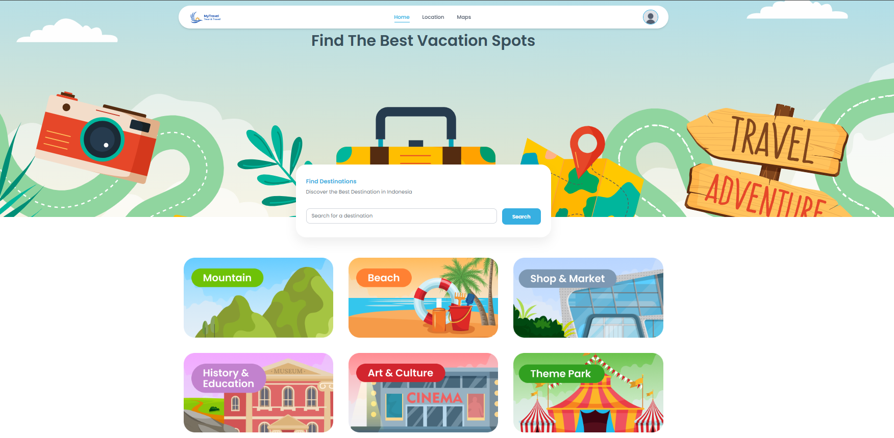
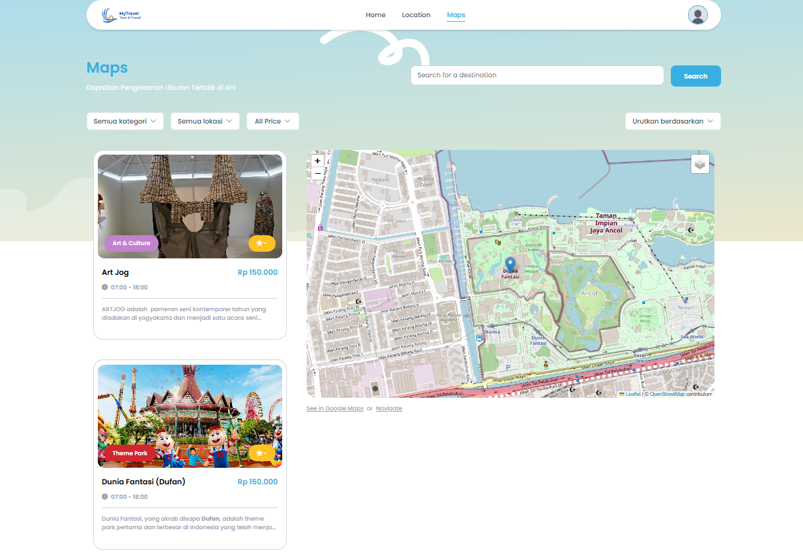
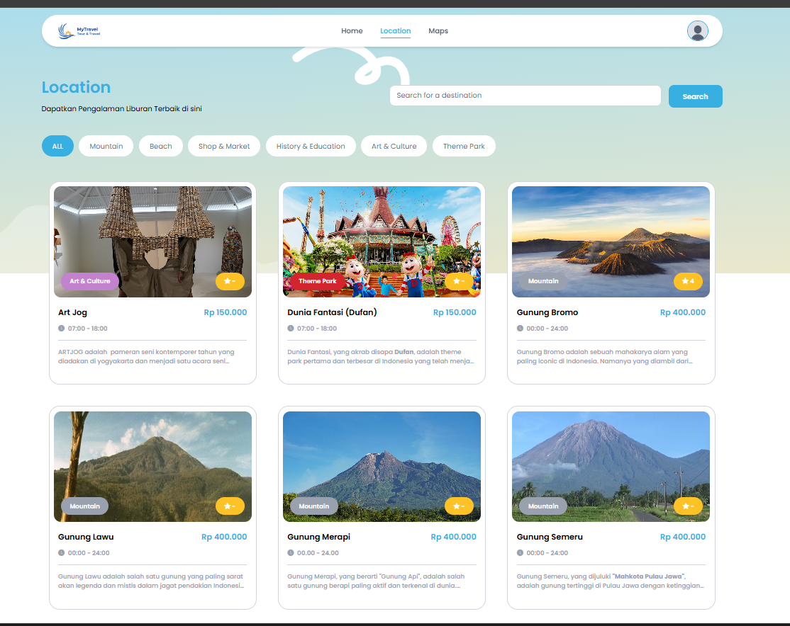
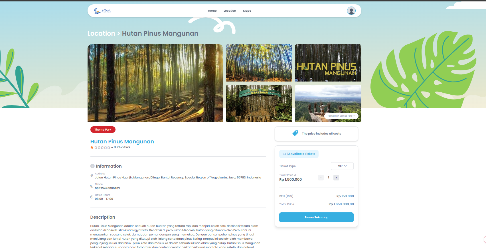
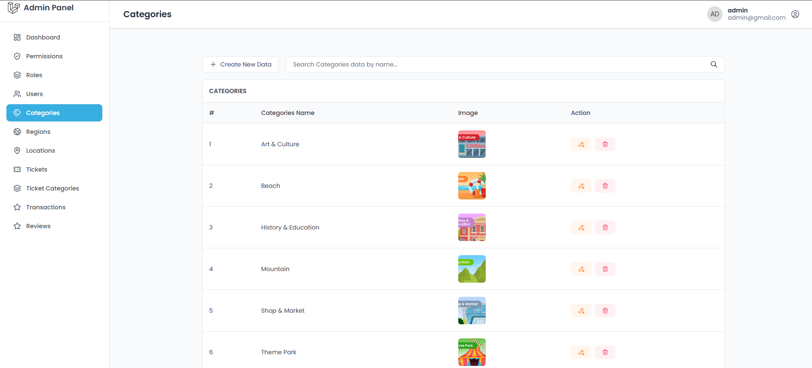
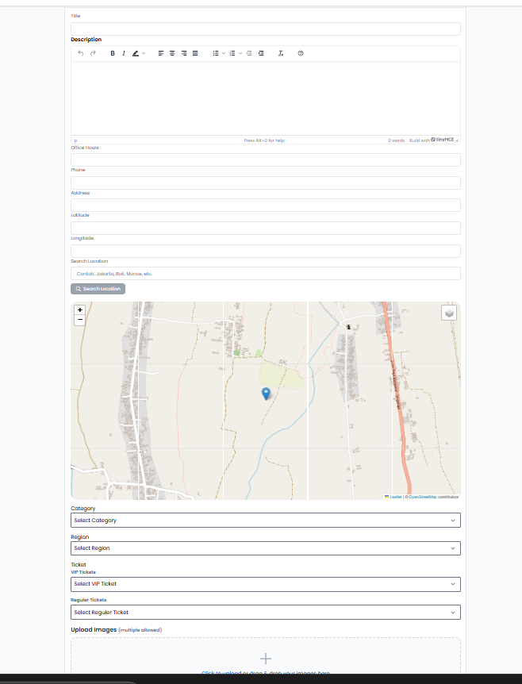

# My_TravelApp 🌍

A modern, dynamic travel booking platform built with the robust Laravel ecosystem and React.js. This application allows users to explore destinations, book trips, and handle payments seamlessly.

## 🚀 Tech Stack

- **Backend:** [Laravel 12](https://laravel.com/)
- **Frontend:** [React.js](https://reactjs.org/)
- **State Management & Bridge:** [Inertia.js](https://inertiajs.com/)
- **Database:** MySQL
- **Maps:** [OpenStreetMap](https://www.openstreetmap.org/) (Leaflet/React-Leaflet)
- **Payment Gateway:** [Xendit](https://www.xendit.co/)
- **Design:** [Figma](https://www.figma.com/)

## ✨ Key Features

- **Dynamic Content:** Managed through a powerful Laravel backend.
- **Interactive Maps:** Real-world location tracking and destination markers using OpenStreetMap.
- **Secure Payments:** Integrated with Xendit for automated and secure payment processing.
- **Modern UI/UX:** Responsive design implemented based on high-fidelity Figma prototypes.
- **Single Page Application (SPA) Experience:** Powered by Inertia.js for smooth transitions without page reloads.

## 📸 Preview

### 🖥️ User Interface
| Home Page | Destination & Maps |
|---|---|
|  |  |

| Destination Detail | Payment Gateway (Xendit) |
|---|---|
|  |  |

### 🔐 Admin Dashboard
| Analytics & Overview | Management Travel |
|---|---|
|  |  |

## 🛠️ Installation

1. **Clone the repository:**
   ```bash
   git clone [https://github.com/ranggautama47/My_TravelApp.git](https://github.com/ranggautama47/My_TravelApp.git)
   cd My_TravelApp

    Install Backend Dependencies:
    Bash

    composer install

    Install Frontend Dependencies:
    Bash

    npm install

    Environment Setup: Copy .env.example to .env and configure your database and Xendit API keys.
    Bash

    cp .env.example .env

    Generate App Key:
    Bash

    php artisan key:generate

    Run Migrations & Seeders:
    Bash

    php artisan migrate --seed

    Compile Assets:
    Bash

    npm run dev

    Serve the Application:
    Bash

    php artisan serve

💳 Payment Integration

This app uses Xendit for processing payments. To enable this feature, make sure to add your XENDIT_SECRET_KEY and XENDIT_CALLBACK_TOKEN in the .env file.
🗺️ Map Configuration

OpenStreetMap is used to display destination locations. It is integrated using Leaflet.js to ensure no expensive API keys are required while maintaining high performance.
🎨 Design

The UI was meticulously crafted in Figma before implementation to ensure the best user experience and visual consistency.
--
Developed with ❤️ by Rangga Utama
